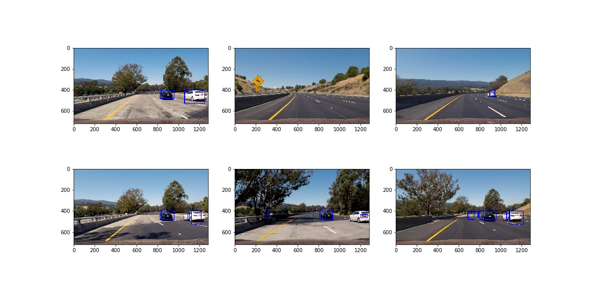

**Vehicle Detection Project**

I think this was an easier project, than the previous one (due to the functions supplied), however it needed time to pipe together the functions. 

----

Let's go over the main points!

After reading in the images, I have applied different feature extraction methods.

All of the code can be found in `car_detection.ipynb`

### Histogram of Oriented Gradients (HOG) and other features

I have tried out different parameters for the HOG, and ultimately found orient=11, pix_per_cell=8, cell_per_block=2 and all color channels to be working the best. I have modified the classroom's function, to be more robust for pictures and videos. Lower orients resulted in lower accuracy, however higher orients resulted in too many features, so I took a little higher than 9, but still managable number.

 

I have also included spatial binning and YUV color channel as features. You can see the implementation in the ipynb. 

#### Training

I tried out Linear SVM, SVM with rbf kernel and AdaBoost classifier. The LinSVM and AdaBoost achieved really high accuracy (+98%), however after using both on the images, I settled with the Linear SVM. 

I split the data before training, shuffled it and fit a scaler only using the training data. 

### Sliding Window Search

I used the function from the classroom, howeer had to modify it, because of my whole pipeline was built on cv2 imread. This resulted in different scales of data, to what the function was working with. 

I tried out different sizes and scales for the windows, and got some inspiration from other Udacity students. I ended having 10 different start-end-scale trios. 

You can see them on this picture:

#### Heatmap and bounding boxes

I used different thresholds for the heatmaps, as some resulted in false positives and some didn't see the car. I then settled with 2 for a single image, and 3, if it was video and contained previous heatmaps.

You can see the result of the heatmap approach:

And the result of drawing bounding boxes over cars:

---

### Video Implementation

#### 1. Video
Here's a [link to my video result](./output_images/project_vid.mp4)

#### 2. Previous frames

I saved the last 10 frames and added up the heatmaps (so if a pixel had a "hit" 2 times on each frame, its value would be 20). I then tried out different threshold methods (adaptive, such as proporsional to the number of previous frames, where there was someting seen), but ended up using 3, as it provided good results without a lot of false positives. Due to the fact, that it uses previous frames, there is some carry over effect for the next frames. 

---

### Discussion

#### 1. Problems and extensions

My biggest rpoblem was, that even though I scaled the features, I forgot to train the classifier on them, and then I looked for the problem elsewhere. But finally I figures it out and all was working.

I think this problem screams for using CNNs, and I know that in the past years there were really big advancements in this topic (ie.YOLO), It would be cool to try it out on  this project (however, I was running out of time).